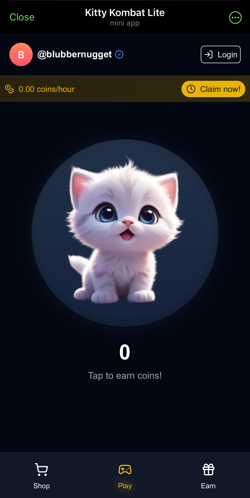

# Kitty Kombat Lite

View live demo on Telegram: [https://t.me/KittyKombatLiteBot/app/](https://t.me/KittyKombatLiteBot/app/)



---

# Production Setup Guide

## Prerequisites

1. Create accounts and gather credentials:
    - [Vercel](https://vercel.com) account for deployment
    - [Magic.link](https://magic.link) dashboard account
    - [Flow Wallet](https://wallet.flow.com) mainnet account

## Environment Setup

1. Create a `.env` file in your project root:

```properties
NEXT_PUBLIC_MAGIC_API_KEY=your_magic_publishable_key
```

2. Set up Flow credentials:
    - Create `mainnet-account.pkey` file with your Flow private key

-   View your private key by navigating to: Flow Wallet chrome extension > settings > account list > [account] > private key
-   Update `flow.json` with your mainnet account address

```sh
{
  "accounts": {
    "mainnet-account": {
      "address": "<YOUR_FLOW_ADDRESS>",
      "key": {
        "type": "file",
        "location": "mainnet-account.pkey"
      }
    }
  }
}
```

## Smart Contract Deployment

1. Install Flow CLI:

```sh
sh -ci "$(curl -fsSL https://raw.githubusercontent.com/onflow/flow-cli/master/install.sh)"
```

2. Deploy contract to mainnet:

```sh
flow project deploy --network mainnet
```

## Frontend Deployment

1. Install dependencies:

```sh
npm install
```

2. Build the project:

```sh
npm run build
```

3. Deploy to Vercel:

```sh
vercel --prod
```

## Security Notes

-   Keep your `mainnet-account.pkey` secure and never commit it to version control

-   Your Magic.link publishable key `NEXT_PUBLIC_MAGIC_API_KEY` is safe to commit

-   Add `.env` to your `.gitignore` file if it's not already there
